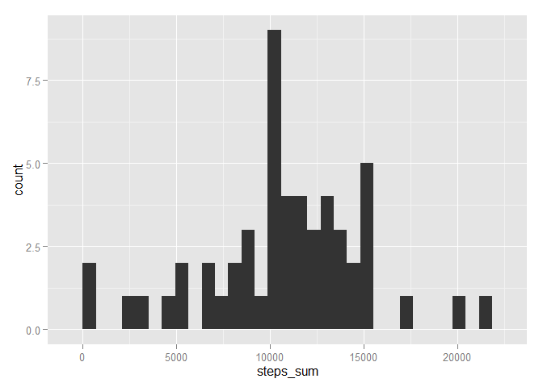
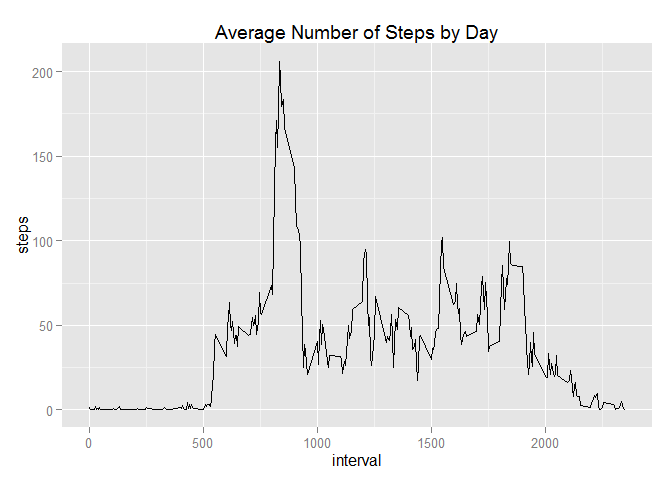
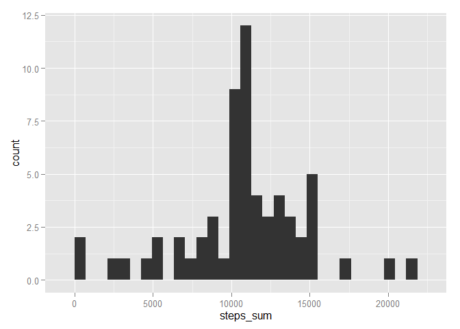
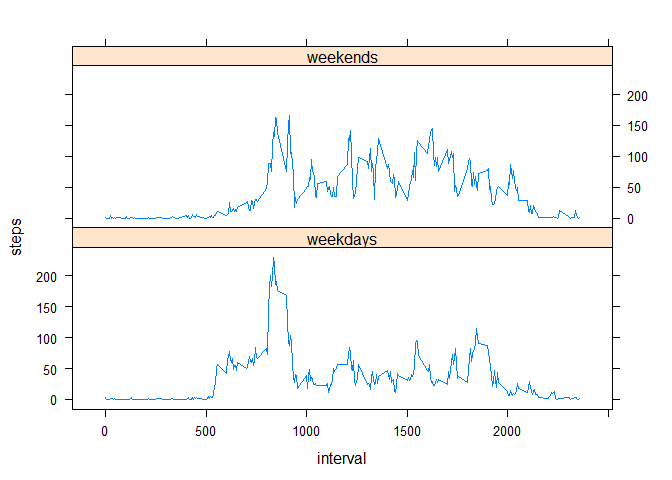

# Research: Peer Assessment 1

Metada:

steps: Number of steps taking in a 5-minute interval (missing values are coded as NA)

date: The date on which the measurement was taken in YYYY-MM-DD format

interval: Identifier for the 5-minute interval in which measurement was taken


## Loading and preprocessing the data


```r
unzip(zipfile = "activity.zip")
repdata <- read.csv("activity.csv", header = T)
str(repdata)
```

```
## 'data.frame':	17568 obs. of  3 variables:
##  $ steps   : int  NA NA NA NA NA NA NA NA NA NA ...
##  $ date    : Factor w/ 61 levels "2012-10-01","2012-10-02",..: 1 1 1 1 1 1 1 1 1 1 ...
##  $ interval: int  0 5 10 15 20 25 30 35 40 45 ...
```

```r
head(repdata)
```

```
##   steps       date interval
## 1    NA 2012-10-01        0
## 2    NA 2012-10-01        5
## 3    NA 2012-10-01       10
## 4    NA 2012-10-01       15
## 5    NA 2012-10-01       20
## 6    NA 2012-10-01       25
```

```r
# loading packages
library(ggplot2)
library(dplyr)
```

```
## 
## Attaching package: 'dplyr'
## 
## The following objects are masked from 'package:stats':
## 
##     filter, lag
## 
## The following objects are masked from 'package:base':
## 
##     intersect, setdiff, setequal, union
```

```r
library(lattice)
```

## What is mean total number of steps taken per day?


```r
# Calculate the total number of steps taken per day
group_by(repdata[!is.na(repdata$steps),], date) %>%
        summarise(steps_sum = sum(steps))
```

```
## Source: local data frame [53 x 2]
## 
##          date steps_sum
## 1  2012-10-02       126
## 2  2012-10-03     11352
## 3  2012-10-04     12116
## 4  2012-10-05     13294
## 5  2012-10-06     15420
## 6  2012-10-07     11015
## 7  2012-10-09     12811
## 8  2012-10-10      9900
## 9  2012-10-11     10304
## 10 2012-10-12     17382
## ..        ...       ...
```

```r
# Plot a histogram  
group_by(repdata[!is.na(repdata$steps),], date) %>%
        summarise(steps_sum = sum(steps)) %>%
        ggplot(aes(steps_sum)) + geom_histogram()
```

```
## stat_bin: binwidth defaulted to range/30. Use 'binwidth = x' to adjust this.
```

 

```r
# Calculate and report the mean and median of the total number of steps taken per day 
group_by(repdata[!is.na(repdata$steps),], date) %>%
        summarise(steps_mean = mean(steps),
                  steps_median = median(steps))  
```

```
## Source: local data frame [53 x 3]
## 
##          date steps_mean steps_median
## 1  2012-10-02    0.43750            0
## 2  2012-10-03   39.41667            0
## 3  2012-10-04   42.06944            0
## 4  2012-10-05   46.15972            0
## 5  2012-10-06   53.54167            0
## 6  2012-10-07   38.24653            0
## 7  2012-10-09   44.48264            0
## 8  2012-10-10   34.37500            0
## 9  2012-10-11   35.77778            0
## 10 2012-10-12   60.35417            0
## ..        ...        ...          ...
```

## What is the average daily activity pattern?


```r
# Plot a time series  
qplot(y = steps, x = interval, geom = "line", 
        data = aggregate(steps ~ interval, FUN = mean, data = repdata),
      main = "Average Number of Steps by Day")
```

 

```r
# Which 5-minute interval, on average across all the days in the dataset, contains the maximum number of steps?    
max(data = aggregate(steps ~ interval, FUN = mean, data = repdata)$interval)
```

```
## [1] 2355
```

## Imputing missing values


```r
# Calculate and report the total number of missing values in the dataset (i.e. the total number of rows with NAs)

sum(is.na(repdata$steps))
```

```
## [1] 2304
```

```r
# Replacing the NAs values for the means of each 5-minute interval

new.dt <- aggregate(steps ~ interval, FUN = mean, data = repdata)

repdata_woNA <- repdata
for (i in 1:nrow(repdata_woNA)) {
        if (is.na(repdata_woNA$steps[i])) {
               place <- match(repdata_woNA$interval[i], new.dt$interval)
               repdata_woNA$steps[i] = new.dt$steps[place]
        } else {}
}

# Plot a histogram from the new dataset
group_by(repdata_woNA, date) %>%
        summarise(steps_sum = sum(steps)) %>%
        ggplot(aes(steps_sum)) + geom_histogram()
```

```
## stat_bin: binwidth defaulted to range/30. Use 'binwidth = x' to adjust this.
```

 

```r
# Calculate and report the mean and median of the total number of steps taken per day from the new dataset
group_by(repdata_woNA, date) %>%
        summarise(steps_mean = mean(steps),
                  steps_median = median(steps))  
```

```
## Source: local data frame [61 x 3]
## 
##          date steps_mean steps_median
## 1  2012-10-01   37.38260     34.11321
## 2  2012-10-02    0.43750      0.00000
## 3  2012-10-03   39.41667      0.00000
## 4  2012-10-04   42.06944      0.00000
## 5  2012-10-05   46.15972      0.00000
## 6  2012-10-06   53.54167      0.00000
## 7  2012-10-07   38.24653      0.00000
## 8  2012-10-08   37.38260     34.11321
## 9  2012-10-09   44.48264      0.00000
## 10 2012-10-10   34.37500      0.00000
## ..        ...        ...          ...
```

```r
# We now get some days like 10/01/2012 that we didnt have because they were NAs,
# for those dates that didnt have NAs the mean, sum or median wouldnt change
group_by(repdata_woNA, date) %>%
        summarise(steps_sum = sum(steps)) 
```

```
## Source: local data frame [61 x 2]
## 
##          date steps_sum
## 1  2012-10-01  10766.19
## 2  2012-10-02    126.00
## 3  2012-10-03  11352.00
## 4  2012-10-04  12116.00
## 5  2012-10-05  13294.00
## 6  2012-10-06  15420.00
## 7  2012-10-07  11015.00
## 8  2012-10-08  10766.19
## 9  2012-10-09  12811.00
## 10 2012-10-10   9900.00
## ..        ...       ...
```

## Are there differences in activity patterns between weekdays and weekends?


```r
# Create a new factor variable in the dataset with two levels - "weekday" and "weekend" indicating whether a given date is a weekday or weekend day.

repdata_woNA <- transform(repdata_woNA, date = as.Date(date))
wkdays <- weekdays(repdata_woNA$date, abbreviate = 1)

repdata_woNA <- transform(repdata_woNA, 
        wk_filter = factor(ifelse(wkdays %in% c("dom","sáb"),1,0),
                           labels=c("weekdays","weekends")))

# Plot a time series across weekdays and weekends

xyplot(steps ~ interval | wk_filter,  type = "l",
       layout = c(1,2), 
       data = aggregate(steps ~ interval + wk_filter, FUN = mean, 
                        data = repdata_woNA))
```

 


